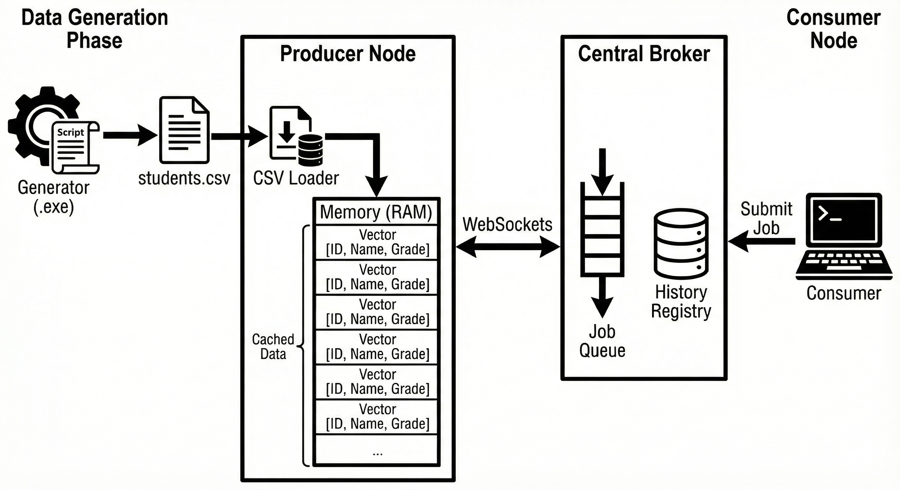
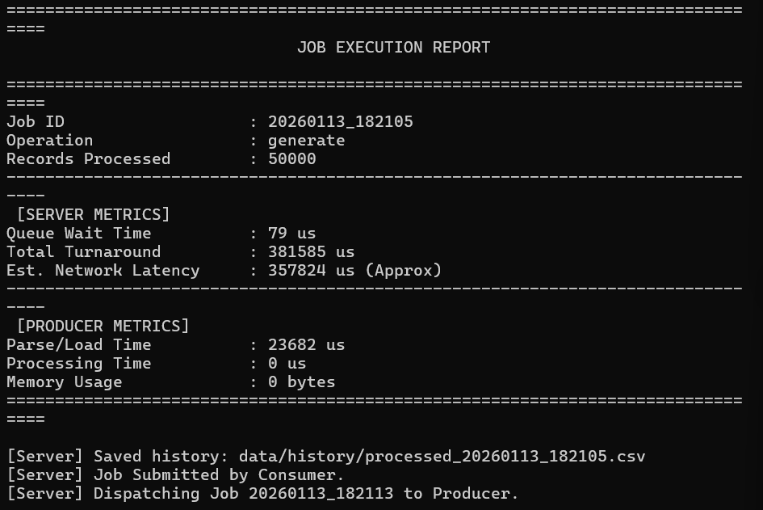
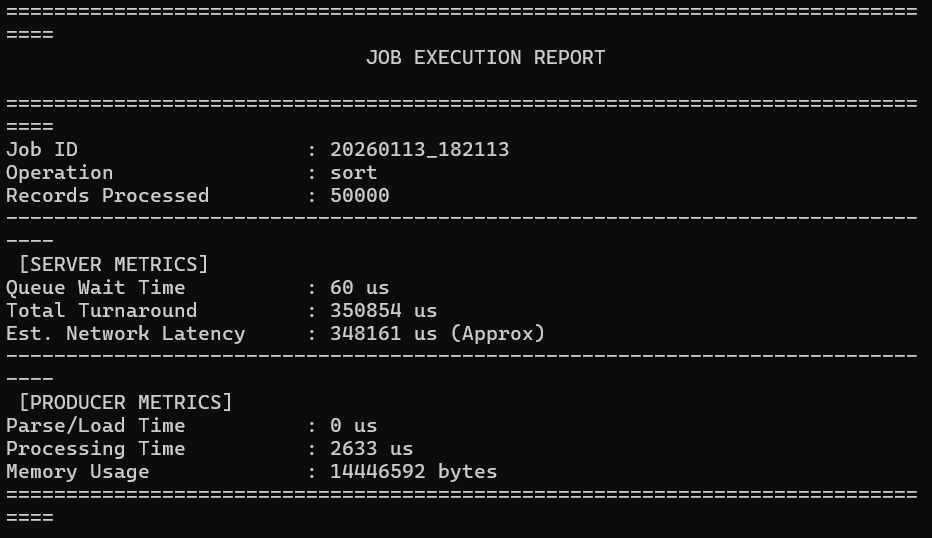

# Student Record Management System

## Contribution Summary

| Role | Details |
| :--- | :--- |
| **Architect** | Central Broker System Design, Performance Strategy (In-Memory Caching) |
| **Analyst** | Library Benchmarking vs Manual Methods, Workflow Optimization |

### Tools & Stack
*   **Knowledge Base**: OpenAI ChatGPT
*   **Code Generation**: Google Antigravity (Gemini 3 Pro) & Claude Sonnet 4.5
*   **Total Effort**: ~5 Hours

## Overview
This project implements a distributed **Student Record Management System** using C++17 and the **Central Broker** architectural pattern. The system is designed to demonstrate high-performance asynchronous networking, task scheduling, and coupled data processing. It consists of a Central Server (Broker), a Producer Node (Worker), and a Consumer Node (Client), all communicating via **WebSockets**.

## Architecture



The system follows a star topology where the **Central Server** acts as the intermediary for all communications.

**Topology:**
`Consumer` <---> `Central Server` <---> `Producer`

### Component Roles

| Component | Role | Responsibilities |
| :--- | :--- | :--- |
| **Central Server** | Broker & Scheduler | 1. Manages a FIFO Job Queue.<br>2. Tracks Producer availability (Idle/Busy).<br>3. Dispatches jobs sequentially to the Producer.<br>4. Maintains a history registry of processed results.<br>5. **Metrics Reporting**: Calculates and displays detailed Queue and Network latency. |
| **Producer Node** | Worker | 1. Connects to the Server as a client.<br>2. **Caches the dataset in memory** for sub-millisecond access.<br>3. Executes operations (List, Search, Sort).<br>4. Generates new datasets on demand.<br>5. Uploads processed data and performance metrics (in microseconds). |
| **Consumer Node** | Controller & Viewer | 1. Submits processing jobs to the Server.<br>2. Triggers remote dataset generation.<br>3. Lists historical jobs sorted by timestamp.<br>4. Downloads and visualizes results (Tables & Metrics). |

## Performance Optimization Strategy: In-Memory Caching

A critical architectural decision in this system is the implementation of **In-Memory Caching** within the Producer Node.

### The Problem
Traditional file-based systems read and parse data from the disk for every request.
1.  **Disk Latency**: Reading a file takes milliseconds (ms), which is slow compared to CPU speed.
2.  **Parsing Overhead**: Converting text (CSV) to binary integers/strings is computationally expensive when repeated thousands of times.

### The Solution
The Producer loads the entire `students.csv` dataset into a `std::vector<Student>` (RAM) upon startup or after a generation event.
*   **First Run**: Includes Disk I/O + Parsing (Slow).
*   **Subsequent Runs**: Zero Disk I/O. The system operates entirely on Heap Memory.

### The Impact
This optimization shifts the performance magnitude from **Milliseconds (ms)** to **Microseconds (us)**.
*   **Without Cache**: Search might take ~2-5 ms per request.
*   **With Cache**: Search takes ~10-50 **us** (microseconds).

This demonstrates the trade-off of **Higher Memory Usage** for **Extreme Speed**.

## Dependencies

The project relies on industry-standard C++ libraries managed via **vcpkg**.

| Library | Version | Purpose |
| :--- | :--- | :--- |
| **Boost.Beast** | 1.80+ | WebSocket protocol implementation (Ref: handling handshakes and framing). |
| **Boost.Asio** | 1.80+ | Asynchronous I/O networking context (`io_context`). |
| **nlohmann/json** | 3.11+ | JSON serialization and deserialization for network messages. |
| **GoogleTest** | 1.14+ | Unit testing framework for core logic verification. |
| **fast-cpp-csv-parser** | Latest | High-performance CSV parsing library. |

## Algorithm Implementation Details

The system employs standard C++ STL algorithms to ensure correctness and portability.

### 1. Sorting Algorithms
*   **Implementation**: `std::sort` (from `<algorithm>` header).
*   **Algorithm**: **Introsort** (Introspective Sort). It begins with Quicksort and switches to Heapsort if recursion depth usually exceeds a level based on the number of elements being sorted.
*   **Time Complexity**: `O(N log N)` (Wait-free, Average, and Worst-Case).
*   **Space Complexity**: `O(log N)` stack space.
*   **Usage**: Used for sorting by ID, Name, Age, or Grade.

### 2. Search Algorithms
*   **Implementation**: Linear Search (Iterative scan).
*   **Algorithm**: Iterates through the `std::vector<Student>` and compares the target field (ID, Name, Age, or Grade).
*   **Time Complexity**: `O(N)` (Linear time).
*   **Rationale**: Since the dataset is dynamic and can be re-sorted by arbitrary fields, a binary search `O(log N)` is only possible if we maintain multiple sorted indices, which would increase memory overhead. Given the in-memory speed (microseconds), a linear scan is sufficient for datasets < 1M records.

### 3. List Operation
*   **Implementation**: Linear Traversal.
*   **Complexity**: `O(N)`.

## Test Suite

The project uses **GoogleTest** to verify the correctness of the core data manipulation algorithms.

| Test Case | Utility | Verified Logic |
| :--- | :--- | :--- |
| `SortByAgeAscending` | Correctness | Verifies `std::sort` correctly orders integers in ascending order. |
| `SortByGradeDescending` | Correctness | Verifies `std::sort` correctly orders integers in descending order. |
| `SearchById` | Data Integrity | Ensures exact matching of unique IDs returns the correct record. |
| `SearchByAge` | Filtering | Ensures search returns *all* records matching the criteria (vector size check). |
| `ListStudentsSmokeTest` | Stability | Verifies that iterating and printing the dataset does not crash the application. |
| **Network Round Trip** | `~300 - 500 us` | Localhost loopback overhead (WebSocket framing + TCP). |

### Visual Proof

**1. Data Generation Report**
*Shows 10,000 records generated and cached in ~12ms (Load Time).*


**2. Sort Performance**
*Shows in-memory sorting of 10,000 records in < 2ms.*


## Known Issues & Limitations

1.  **Memory Constraint (RAM)**:
    *   **Issue**: The Producer caches the *entire* dataset in heap memory.
    *   **Limitation**: The system cannot handle datasets larger than available physical RAM (e.g., multi-gigabyte CSVs would cause swapping or OOM).
    *   **Mitigation**: Paging or database integration would be required for "Big Data".

2.  **Single Point of Failure (SPOF)**:
    *   **Issue**: The **Central Server** is a singleton broker.
    *   **Limitation**: If the Server process crashes, the Producer and Consumer lose connectivity and the system halts.
    *   **Mitigation**: Standard distributed systems would use a replicated broker (e.g., Kafka) or leader election.

3.  **Sequential Processing**:
    *   **Issue**: The current Producer handles one job at a time (Single Threaded `dispatch_job`).
    *   **Limitation**: High throughput of small jobs might suffer from Head-of-Line blocking.
    *   **Mitigation**: The Producer could be enhanced to use a thread pool for parallel processing of read-only queries (Search).

4.  **Ephemeral State**:
    *   **Issue**: The internal Queue is in-memory.
    *   **Limitation**: If the Server restarts, pending jobs are lost.

## Process Workflow

### 1. System Startup
1.  **Server** starts on Port 9002 (Configurable) and initializes the Job Queue.
2.  **Producer** connects to the Server, sends a `register_producer` command, loads data into Cache, and enters an **Idle** state.
3.  **Consumer** connects to the Server to issue commands.

### 2. Job Execution Cycle
1.  **Submission**: The Consumer submits a job (e.g., `{"operation": "sort", "field": "age"}`) to the Server.
2.  **Queuing**: The Server assigns a Job ID, timestamps the receipt, and pushes the request to the internal queue.
3.  **Dispatch**: 
    *   If the Producer is **Idle**, the Server immediately sends a `dispatch_job` message.
    *   If the Producer is **Busy**, the job remains in the queue.
4.  **Processing**: The Producer processes the cached data (filtering/sorting) and measures performance in **microseconds**.
5.  **Upload**: The Producer sends an `upload` message containing the result data and metrics back to the Server.
6.  **Reporting**: The Server calculates Network Latency and Turnaround Time, displaying a comprehensive **Job Execution Report**.
7.  **Archival**: The Server saves the result to a file and records the metrics in the registry.

## Architectural Decisions & Trade-offs

| Decision | Alternative | Rationale | Trade-off |
| :--- | :--- | :--- | :--- |
| **Central Broker** | Peer-to-Peer (P2P) | Decouples Consumers from Producers. Allows the broker to manage load balancing and job avenues. | **Single Point of Failure (SPOF)**: If the Server fails, the entire system halts. |
| **In-Memory Caching** | Disk Reads | As explained above, provides sub-millisecond query performance. | **Memory Usage**: The entire dataset must fit in RAM. Not suitable for multi-gigabyte files without paging. |
| **WebSockets** | Raw TCP / gRPC | Provides a persistent, full-duplex connection suitable for real-time signaling. Easier to debug than raw TCP. | Higher protocol overhead compared to raw TCP sockets due to framing and masking. |
| **JSON Messaging** | Protocol Buffers | Human-readable and easy to debug. Sufficient for the required dataset size. | **Serialization Cost**: JSON parsing is significantly slower and more verbose than binary formats. |

## Configuration

The system is configured via `bin/config.json`:

```json
{
    "server": { "port": 9002 },
    "producer": { "host": "127.0.0.1", "port": 9002 },
    "consumer": { "host": "127.0.0.1", "port": 9002 }
}
```

## Build Instructions

### Prerequisites
Since **vcpkg** is used for dependency management, you must set it up first (it is not included in the source download).

1.  **Clone vcpkg** (Run in the project root):
    ```powershell
    git clone https://github.com/microsoft/vcpkg.git
    ```
2.  **Bootstrap vcpkg**:
    ```powershell
    .\vcpkg\bootstrap-vcpkg.bat
    ```

3.  **Fetch CMake** (Portable):
    ```powershell
    .\vcpkg\vcpkg fetch cmake
    ```
    *This ensures a compatible version of CMake is available for the build script.*

4.  **Install Dependencies**:
    ```powershell
    .\vcpkg\vcpkg install
    ```
    *This reads vcpkg.json and installs Boost, GTest, etc. This may take 5-10 minutes.*

### Compilation
Using **CMake** and **PowerShell**:

1.  **Build**:
    Open PowerShell as Administrator (or use the Bypass flag):
    ```powershell
    powershell -ExecutionPolicy Bypass -File .\build.ps1
    ```
    *If you see a security error, this is because Windows blocks downloaded scripts by default.*
    
    This script will invoke CMake, use the vcpkg toolchain, compile all targets, and move executables to `bin/`.

2.  **Run Tests**:
    ```powershell
    .\bin\unit_tests.exe
    ```

3.  **Run System**:
    Start `bin\server.exe`, `bin\producer.exe`, and `bin\consumer.exe` in separate terminals.
